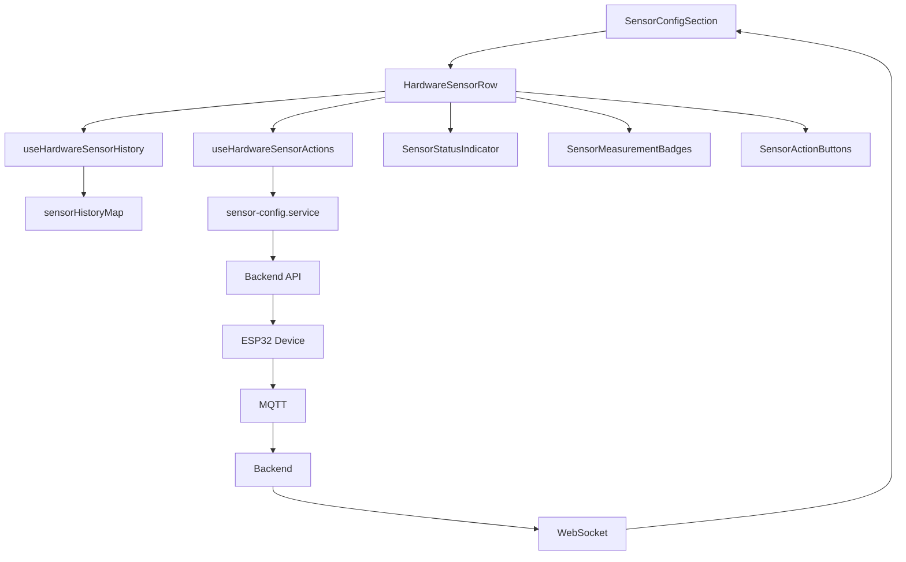

# Sensor Configuration Feature

Cette feature gère la configuration des capteurs matériels (hardware sensors) sur les modules IoT. Elle permet de visualiser l'état des capteurs, modifier leurs paramètres et effectuer des actions de maintenance.

## 📁 Architecture

```
sensor-configuration/
├── components/          # Composants UI
│   ├── HardwareSensorRow.vue         # Ligne de capteur (principal)
│   ├── SensorStatusIndicator.vue     # Indicateur de statut
│   ├── SensorMeasurementBadges.vue   # Badges de mesures
│   ├── SensorActionButtons.vue       # Boutons d'action
│   └── SensorConfigSection.vue       # Section de configuration
├── composables/         # Logique réutilisable
│   ├── useHardwareSensorHistory.ts   # Résolution d'historique
│   ├── useHardwareSensorActions.ts   # Actions API (reset, toggle, interval)
│   └── useSensorConfiguration.ts     # Configuration globale
├── services/            # Appels API
│   ├── sensor-config.service.ts      # API de configuration
│   └── sensor-projection.service.ts  # API de projection
├── utils/              # Fonctions utilitaires
│   ├── status-calculator.ts          # Calcul de statut
│   └── status-helpers.ts             # Helpers d'affichage
├── types/              # Types TypeScript
│   └── sensor-configuration.types.ts
└── config/             # Configuration
    └── hardwareSensors.ts
```

## 🎯 Fonctionnalités

### 1. Visualisation de l'état des capteurs

Chaque capteur affiche :
- **Statut** : Indicateur visuel (vert = OK, rouge = manquant, gris = inconnu)
- **Nom du capteur** : Ex. BME280, SCD41, SGP40
- **Mesures** : Badges colorés pour chaque type de mesure (CO2, VOC, Température, Humidité)
- **Dernière mise à jour** : Compteur "il y a X secondes"

### 2. Actions de contrôle

- **Toggle enable/disable** : Activer/désactiver un capteur
- **Reset** : Redémarrer un capteur bloqué
- **Intervalle de lecture** : Modifier la fréquence de lecture (10-300s)

### 3. Calcul de statut intelligent

Le statut est calculé dynamiquement en fonction :
- Du dernier timestamp reçu
- De l'intervalle configuré
- D'une période de grâce de 10 secondes

**Formule** : `timeout = (interval × 2) + 10s`

Exemple : avec un intervalle de 60s, le capteur est considéré "missing" après 130s sans données.

## 🔧 Composables

### `useHardwareSensorHistory`

Résout l'historique des données de capteur avec fallback automatique.

**Stratégie de résolution** :
1. Essaie la clé composite : `{hardwareKey}:{measureKey}` (ex: `BME280:temperature`)
2. Si non trouvée, fallback vers la clé simple : `{measureKey}` (ex: `temperature`)
3. Si la clé contient déjà `:`, pas de fallback

**Utilisation** :
```typescript
import { useHardwareSensorHistory } from '~/features/sensor-configuration/composables/useHardwareSensorHistory'

const { history, lastUpdate } = useHardwareSensorHistory(
  toRef(hardware, 'hardwareKey'),  // Ex: 'BME280'
  measureKeyRef,                    // Ex: 'temperature'
  sensorHistoryMapRef
)

// history.value : SensorDataPoint[]
// lastUpdate.value : Date | null
```

**Tests** : 8 cas couverts (résolution composite/simple, fallback, réactivité)

---

### `useHardwareSensorActions`

Centralise toutes les actions API avec gestion d'état de chargement.

**Utilisation** :
```typescript
import { useHardwareSensorActions } from '~/features/sensor-configuration/composables/useHardwareSensorActions'

const { 
  resetting, toggling, saving,           // États de chargement
  resetSensor, toggleEnabled, updateInterval  // Actions
} = useHardwareSensorActions(toRef(props, 'moduleId'))

// Reset d'un capteur
await resetSensor('BME280', 'BME280')

// Toggle enable/disable
const newState = await toggleEnabled('BME280', currentState)

// Mise à jour de l'intervalle
await updateInterval('BME280', 60)
```

**Avantages** :
- ✅ Gestion automatique des notifications (snackbar)
- ✅ États de chargement pour l'UI
- ✅ Gestion centralisée des erreurs

---

## 🛠️ Utilitaires

### `status-calculator.ts`

Fonctions pures pour calculer le statut des capteurs.

```typescript
import { calculateSensorStatus } from '~/features/sensor-configuration/utils/status-calculator'

const status = calculateSensorStatus(
  lastUpdate,      // Date | string | null
  intervalSeconds, // number
  Date.now()      // timestamp actuel (optionnel)
)
// Retourne : 'ok' | 'missing' | 'unknown'
```

**Tests** : 16 cas couverts (grace period, formats de date, intervalles variés)

---

### `status-helpers.ts`

Fonctions pures pour l'affichage des statuts.

```typescript
import { 
  getStatusClass,      // Classes CSS pour le dot
  getStatusTextClass,  // Classes CSS pour le texte
  getStatusLabel,      // Label lisible
  getMeasurementVariant // Variant pour UITag
} from '~/features/sensor-configuration/utils/status-helpers'

const dotClass = getStatusClass('ok')        // 'bg-green-500'
const textClass = getStatusTextClass('ok')   // 'text-gray-700 dark:text-gray-200'
const label = getStatusLabel('ok')           // 'OK'
const variant = getMeasurementVariant('ok')  // 'success'
```

**Tests** : 16 cas couverts (tous les statuts × toutes les fonctions)

---

## 🧩 Composants

### `HardwareSensorRow.vue`

**Composant principal** pour afficher une ligne de capteur.

**Props** :
```typescript
interface Props {
  hardware: HardwareData      // Données du capteur
  moduleId: string            // ID du module
  sensorHistoryMap?: Record<string, SensorDataPoint[]>
}
```

**Events** :
```typescript
emit('interval-change', hardwareKey: string, interval: number)
emit('enabled-change', hardwareKey: string, enabled: boolean)
```

**Utilisation** :
```vue
<HardwareSensorRow
  :hardware="sensorData"
  :moduleId="module.id"
  :sensorHistoryMap="historyMap"
  @interval-change="handleIntervalChange"
  @enabled-change="handleEnabledChange"
/>
```

---

### `SensorStatusIndicator.vue`

Affiche l'indicateur de statut visuel.

**Props** :
```typescript
interface Props {
  status: 'ok' | 'missing' | 'unknown'
  isEnabled: boolean
}
```

**Rendu** :
- Disabled → Carré rouge
- Unknown → Spinner gris
- OK → Dot vert
- Missing → Dot rouge

---

### `SensorMeasurementBadges.vue`

Affiche les badges de mesures.

**Props** :
```typescript
interface Props {
  measurements: Measurement[]
  isEnabled: boolean
}
```

---

### `SensorActionButtons.vue`

Boutons d'action (toggle, reset).

**Props** :
```typescript
interface Props {
  isEnabled: boolean
  toggling: boolean
  resetting: boolean
}
```

**Events** :
```typescript
emit('toggle')
emit('reset')
```

---

## 🧪 Tests

### Exécution des tests

```bash
# Mode watch (développement)
npm run test

# Interface UI
npm run test:ui

# Single run (CI)
npm run test:run
```

### Coverage

```bash
npm run test:run -- --coverage
```

### Structure des tests

```
✓ status-calculator.test.ts (16 tests)
  ├─ calculateSensorStatus (9 tests)
  ├─ validateInterval (4 tests)
  └─ formatInterval (3 tests)

✓ status-helpers.test.ts (16 tests)
  ├─ getStatusClass (4 tests)
  ├─ getStatusTextClass (4 tests)
  ├─ getStatusLabel (4 tests)
  └─ getMeasurementVariant (4 tests)

✓ useHardwareSensorHistory.test.ts (8 tests)
  ├─ Key resolution (5 tests)
  ├─ Edge cases (2 tests)
  └─ Reactivity (1 test)
```

### Bonnes pratiques pour ajouter des tests

1. **Tester la logique métier** (composables, utils), pas l'UI
2. **Tests unitaires** : une fonction = un fichier de test
3. **Couverture** : tous les cas + edge cases
4. **Nommage** : `describe('functionName')` → `it('should...')`
5. **Isolation** : pas d'appels API réels (mock si nécessaire)

**Exemple de nouveau test** :
```typescript
// monComposable.test.ts
import { describe, it, expect } from 'vitest'
import { ref } from 'vue'
import { monComposable } from './monComposable'

describe('monComposable', () => {
  it('should handle empty input', () => {
    const input = ref('')
    const { result } = monComposable(input)
    expect(result.value).toBe(null)
  })

  it('should process valid input', () => {
    const input = ref('test')
    const { result } = monComposable(input)
    expect(result.value).toBe('TEST')
  })
})
```

---

## 🔄 Flux de données



**Flux** :
1. Le backend reçoit des données MQTT de l'ESP32
2. Les données sont diffusées via WebSocket
3. `SensorConfigSection` met à jour `sensorHistoryMap`
4. `HardwareSensorRow` utilise le composable pour résoudre l'historique
5. Le statut est calculé en temps réel
6. Les actions utilisent le service pour communiquer avec le backend

---

## 📊 Performance

### Optimisations

1. **Computed properties** : Calculs de statut réactifs et mis en cache
2. **Debouncing** : Sauvegarde d'intervalle avec délai de 500ms
3. **Optimistic UI** : Toggle instantané avant confirmation backend
4. **Key resolution** : Priorité composite → simple pour minimiser les lookups

### Métriques

- **Component size** : 220 lignes (vs 396 avant refactoring)
- **Test coverage** : 40 tests, 100% des fonctions critiques
- **Bundle impact** : Minimal (tree-shaking des composables)

---

## 🚀 Extension de la feature

### Ajouter un nouveau type de capteur

1. **Backend** : Ajouter le capteur dans le manifest du module
2. **Frontend** : La configuration est automatique (pas de code à modifier)
3. **Tests** : Ajouter des cas pour le nouveau type si logique spécifique

### Ajouter une nouvelle action

```typescript
// 1. Ajouter la fonction dans sensor-config.service.ts
export async function nouvelleAction(
  moduleId: string,
  param: string
): Promise<boolean> {
  // Implementation
}

// 2. Ajouter dans useHardwareSensorActions.ts
const nouvelleAction = async (param: string) => {
  // Gestion d'état et appel service
}

// 3. Exposer dans le return du composable
return {
  // ...existing
  nouvelleAction
}

// 4. Utiliser dans le composant
const { nouvelleAction } = useHardwareSensorActions(moduleIdRef)
await nouvelleAction('parametre')
```

### Ajouter un nouveau helper de statut

```typescript
// 1. Dans status-helpers.ts
export function nouveauHelper(status: SensorStatus): string {
  switch (status) {
    case 'ok': return 'value-for-ok'
    // ...
  }
}

// 2. Créer les tests dans status-helpers.test.ts
describe('nouveauHelper', () => {
  it('should return correct value for ok status', () => {
    expect(nouveauHelper('ok')).toBe('value-for-ok')
  })
})

// 3. Run tests
npm run test:run
```

---

## 🐛 Debugging

### Console logs utiles

```typescript
// Dans le composable
console.log('History resolved:', history.value)
console.log('Last update:', lastUpdate.value)

// Dans le composant
console.log('Computed status:', computedStatus.value)
console.log('Hardware data:', props.hardware)
```

### Vérifier le WebSocket

```javascript
// Dans la console du navigateur
// Les données MQTT arrivent via WebSocket et mettent à jour sensorHistoryMap
```

### Tester les actions

```bash
# Vérifier les logs du backend
# Les appels API apparaissent dans les logs du serveur
```

---

## 📝 Checklist pour PR

- [ ] Tests unitaires ajoutés pour nouvelle logique
- [ ] Tous les tests passent (`npm run test:run`)
- [ ] TypeScript sans erreurs (`npx nuxi typecheck`)
- [ ] Lint sans erreurs (`npm run lint`)
- [ ] Documentation mise à jour si API publique modifiée
- [ ] Tests manuels dans le navigateur
- [ ] Pas de console.log oubliés

---

## 🔗 Ressources

- [Vue 3 Composition API](https://vuejs.org/guide/extras/composition-api-faq.html)
- [Vitest Documentation](https://vitest.dev/)
- [Chart.js](https://www.chartjs.org/) (pour les graphiques de données)
- [MQTT Protocol](https://mqtt.org/) (protocole de communication IoT)
